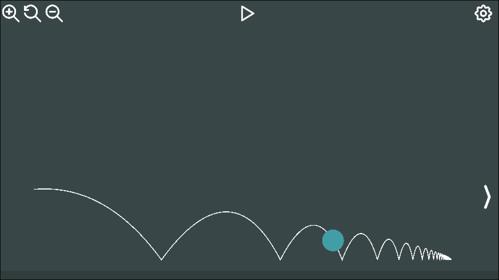

# Simulação de Lançamento Oblíquo em Unity C#

Veja uma [demonstração](https://otavio.fun/fisica)!

## 1. Integrantes do Grupo e Responsabilidades
Disciplina: 7600105 - Física Básica I (2024).\
Docente: Krissia de Zawadzki.

|Nomes | N° USP | Atribuição|
|:------:|:-------:|:-----------:|
|Gustavo Alvares Andó|15457345|Código|
|Lucas Rodrigues Baptista|15577631|Código|
|Otávio Biagioni Melo|15482604|Interface de Usuário|
|Maria Clara de Souza Capato|15475294|Relatório|

## 2. Motivações e Descrição do Projeto
Este projeto é uma simulação criada para ilustrar a trajetória de um Lançamento Oblíquo, com o objetivo de trazer uma representação visual e interativa para os usuários. Houve um foco maior para a interface, de forma que ela seja acessível e intuitiva para o uso. Desenvolvido na Unity, a linguagem utilizada foi o C#, e os ícones e fontes são da LTWave.\
Quando pensamos em Lançamento Oblíquo estamos falando de uma trajetória com movimento em duas dimensões, comumente representadas pelos eixos x e y. Em aulas de física, a representação clássica do movimento é um tiro de canhão, ou um arremesso de um objeto de uma certa altura. Por isso, a representação escolhida buscou ser semelhante às mais comumente exploradas em aulas, trazendo uma visualização mais didática e lúdica e criando uma relação entre o que o usuário possa ter visto anteriormente em seus estudos.\
O projeto foi inicialmente influenciado por uma simulação do [Phet Colorado](https://phet.colorado.edu/pt_BR/simulations/projectile-motion), a qual traz o movimento de um projétil disparado por um canhão de acordo com as configurações escolhidas pelo usuário. Nossa simulação se espelhou nessa forma de interação, tentando fazer com que o usuário sinta-se livre para brincar com as condições iniciais e assistir como cada fator influencia na trajetória do corpo teste. \
Existem duas opções para a simulação, que podem ser comparadas ao mesmo tempo: a utilizando a resolução das EDO's que serão apresentadas a seguir (em azul) e a utilizando a integração de Verlet (em vermelho).

  
   

<!-- fotinho do projeto -->

## 3. Conceitos Físicos e Modelo Matemático
### Força Gravitacional
A força gravitacional $F_g$ pode ser expressa por:

$$\begin{equation}
F_g = -mg \hat{j},
\end{equation}$$

em que $m$ é a massa do corpo afetado, $g$ a gravidade e $\hat{k}$ o versor que indica a direção do movimento, neste caso, para cima. Vale notar que esta é uma força constante, que não depende da trajetória, apenas da gravidade local.

### Força Viscosa
A força viscosa $F_v$ é expressa por:

$$\begin{equation}
F_v = -bv,
\end{equation}$$

em que $b>0$ e $v$ a velocidade do corpo afetado. Essa força tem relação direta com velocidade do corpo, variando de forma proporcial à ela no tempo, mas com sentido contrário.

### Movimento do Corpo e EDO's
Nosso projétil sofre a ação de ambas as forças descritas acima, tendo sua posição nos eixos $x$ (horizontal, orientado positivamente para a direita) e $y$ (vertical, orientado positivamente para cima) representada por:

$$\begin{equation}
r(t) = x(t) \hat{i} + y(t) \hat{j}.
\end{equation}$$

Sua velocidade, derivada da posição, se dá por:

$$\begin{equation}
v(t) = \dot{x}(t) \hat{i} + \dot{y}(t) \hat{j},
\end{equation}$$

e sua aceleração, derivada segunda da posição e primeira da velocidade é:

$$\begin{equation}
a(t) = \ddot{x}(t) \hat{i} + \ddot{y}(t) \hat{j}.
\end{equation}$$

Como condições iniciais, temos:

$$\begin{align}
x(0) &= y(0) = 0,\\
\dot{x}(0) &= v_0 cos(\theta),\\
\dot{y}(0) &= v_0 sin(\theta).
\end{align}$$

Aplicando a 2ª Lei de Newton, chegamos às seguintes equações

$$\begin{align}
-mg\hat{j} -bv(t) &= m(\ddot{x}(t)\hat{i} + \ddot{y}(t)\hat{j}),\\
\ddot{x}(t) + b{y}(t) &= 0,\\
\ddot{y}(t) + b{y}(t) + mg &= 0,
\end{align}$$

e às seguintes EDO's,

$$\begin{align}
\ddot{x}(t) &= \frac{-b}{m}\dot{x}(t),\\
\ddot{y}(t) &= \frac{-b}{m}\dot{y}(t),
\end{align}$$

as quais têm suas soluções dadas por:

$$\begin{align}
x(t) &= \tau v_0 \cos\theta (1- e^{\frac{-t}{\tau}}),\\
y(t) &= (v_0 \sin\theta + g\tau^{2})(1- e^{\frac{-t}{\tau}}) -g\tau t,
\end{align}$$

sendo $\tau$ definida como $\frac{m}{b}$.

### Integração de Verlet
O método de Verlet é um algoritmo utilizado para o cálculo das posições de um corpo, muito usado para simulações, como em nosso caso.\\
Seu algoritmo busca reduzir o nível de erros nos cálculos utilizando as posições e aceleração anteriores para o cálculo da próxima posição. Assim, a cada pequena variação no tempo, a posição é recalculada e as variáveis são atualizadas para o próximo cálculo. Uma de suas vantagens é a conservação aproximada da energia do sistema, e é considerado um método mais estável que o de Euler.

## 4. O Projeto
<!-- Como acessar o projeto -->
### Botões
Cada botão tem um ícone próprio, ilustrativo para sua função correspondente.
* Configurações: Abre uma aba para modificar as condições de lançamento;
* Lançar: Reinicia a simulação com as condições especificadas;
* Lupas: Aumentam, diminuem ou reiniciam o zoom da câmera (pode ser alterado pelo scroll do mouse);
* Setas: Movimentam a câmera horizontalmente (pode ser movido com as setinhas do teclado);

### Configurações
Acessando as configurações, é possível modificar os parâmetros e condições iniciais livremente.
* Tipo de Simulação: escolha entre mostrar uma, nenhuma ou ambas as simulações (EDO's ou integração de Verlet);
* Gravidade: varia de 0 a 100, em m/s²;
* Velocidade inicial: varia de 0 a 100, em m/s;
* Ângulo inicial: varia de -90 a 90, em graus;
* Viscosidade: varia de 0.01 a 10, em m²/s;
* Altura Inicial: varia de 0 a 28, em metros;
* Massa do Projétil: varia de 0.1 a 100, em kg;
* Time Step: varia de 5 a 120;
* Colisões calculadas: varia de 0 a 100;
* Iterações do Método de Newton: varia de 0 a 100;

## Referências
1. Phet Colorado, 2024. Disponível em: [Phet Colorado](https://phet.colorado.edu/pt_BR/simulations/projectile-motion). Acesso em 20 de novembro de 2024.
2. Bernardes, E. de S. (2024). Dinâmica-v4 (Notas de aula). 7600105 - Física Básica I. Universidade de São Paulo, São Carlos. Acesso em 28 de novembro de 2024.
3. FREIRE, Wilson Hugo C.; MEDEIROS, Marciano L.; LEITE, Daniela; SILVA, Raffaela M. Lançamento oblíquo com resistência do ar: Uma análise qualitativa. SciELO Brasil, [s. l.], 30 set. 2015. Disponível em: https://doi.org/10.1590/S1806-11173812085. Acesso em: 5 dez. 2024.
